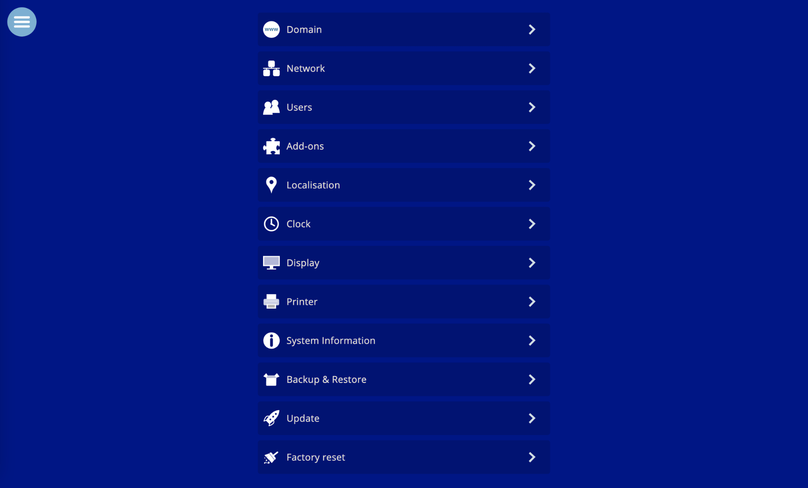
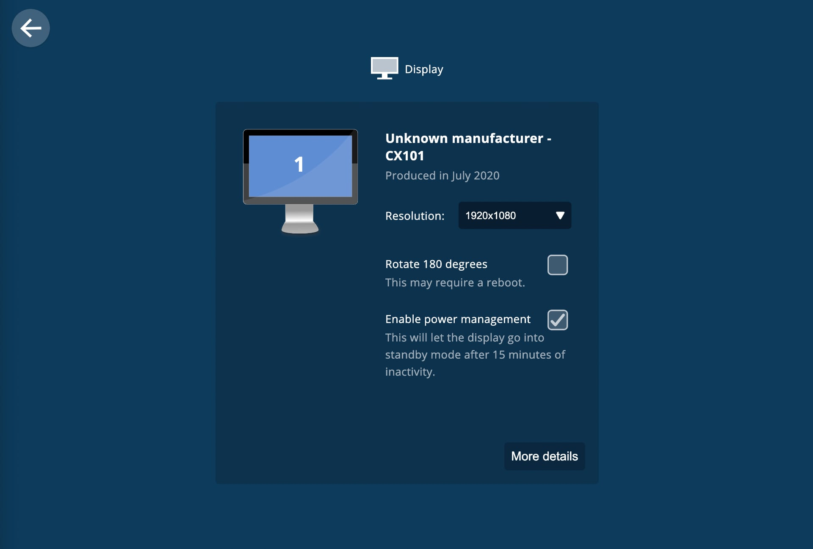

# power-settings
A core component of the Candle smart home controller.

- Adds menu buttons for shutdown and reboot
- Adds backup and restore functionality
- Manage system clock
- Manages system updates
- See system information
- Change display settings
- Connect a printer
- More...

Learn more at:

https://www.candlesmarthome.com
